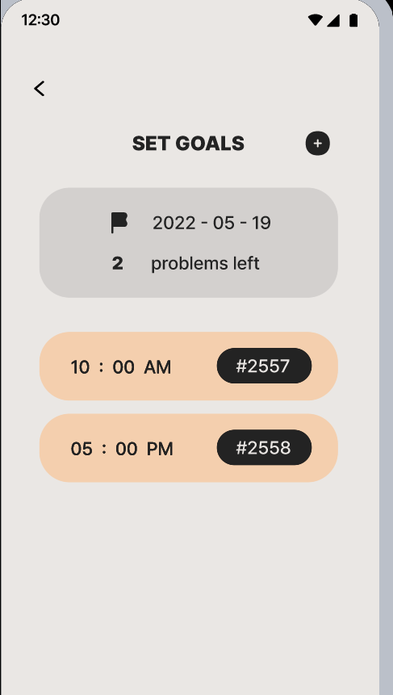
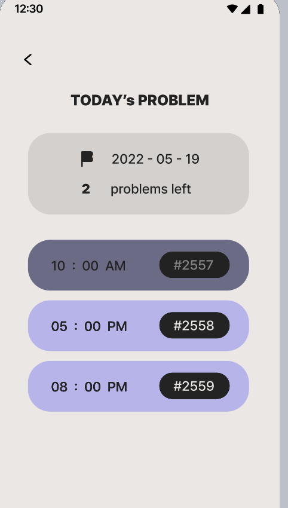
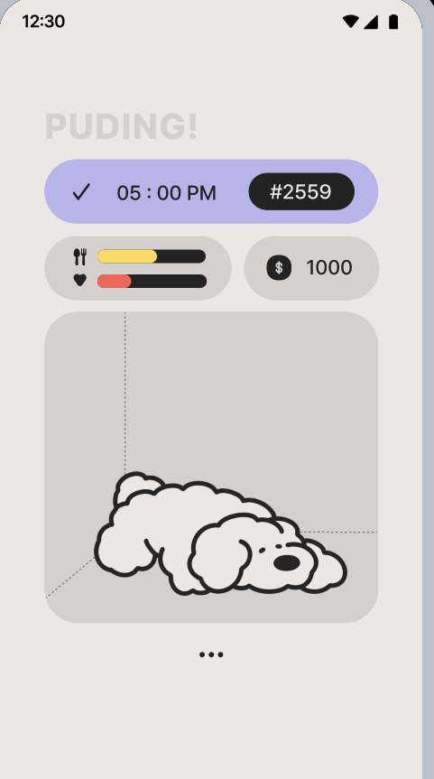

# PUDING: Your Coding Mate 🐶✨

PUDING is a mobile app that motivates users to practice coding daily by guiding them through goal setting, solving problems, and submitting proof to earn rewards — all while keeping a virtual pet happy!

---

## 📌 Overview

**PUDING** is a mobile coding companion that helps users build healthy coding habits in a fun, gamified way.  
Users can set custom coding goals, solve daily problems, upload proof, and use earned coins to take care of their virtual puppy.  
The app encourages consistency through simple goal tracking and an interactive pet that reacts to the user’s progress.

---

## 🔧 Key Features

- **Goal Setting:** Create personal coding goals with custom time, repeat frequency, and problem details.
- **Problem Solving:** Solve recommended coding problems and submit proof of completion with screenshots.
- **Reward System:** Earn coins for solving problems and use them to keep a virtual pet happy, with dynamic status bars.

---

## 🛠️ Tech Stack

- **Frontend:** Android (Java / Kotlin)
- **Design:** Figma (High-fidelity prototyping)
- **Backend / Logic:** Android Studio
- **Gamification:** Virtual pet status system, reward store

---

## 📑 How It Works

1. **Set Your Goals:**  
   Add and manage daily coding tasks in the 'Work' tab — set the time, repetition, and problem details.

2. **Solve Problems & Submit Proof:**  
   Work on the recommended coding problems, then upload a screenshot as confirmation.  
   Each problem has a unique ID and link for easy access.

3. **Reward Your Pet:**  
   Earn coins by solving problems and spend them on food or toys for your virtual puppy.  
   The puppy’s happiness and hunger bars change dynamically based on your coding progress.

---

## 📸 Screenshots

| Goal Setting | Problem Solving | Virtual Pet |
|--------------|-----------------|--------------|
|  |  |  |

---

## 📘 What I Learned

- Designed and developed an interactive Android app from wireframes to high-fidelity prototypes.
- Practiced user-centered design principles to motivate daily coding through gamification.
- Implemented goal-setting features and CRUD operations.
- Built a reward system linking user activity to a dynamic virtual pet to boost engagement.
- Collaborated effectively in a team, dividing tasks across goal management, problem management, and UI/UX design.

---

## 🔗 Links

- [🎥 Presentation Video](https://youtu.be/a0442foi_AE)

---

## ✨ Credits

Built by Team Phoenix for our final HCI project — combining gamification, user-centered design, and daily coding motivation into one mobile experience!
